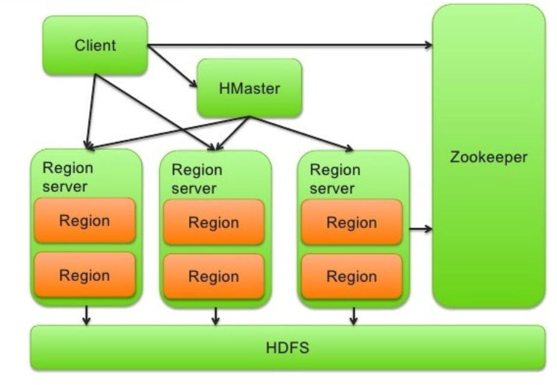
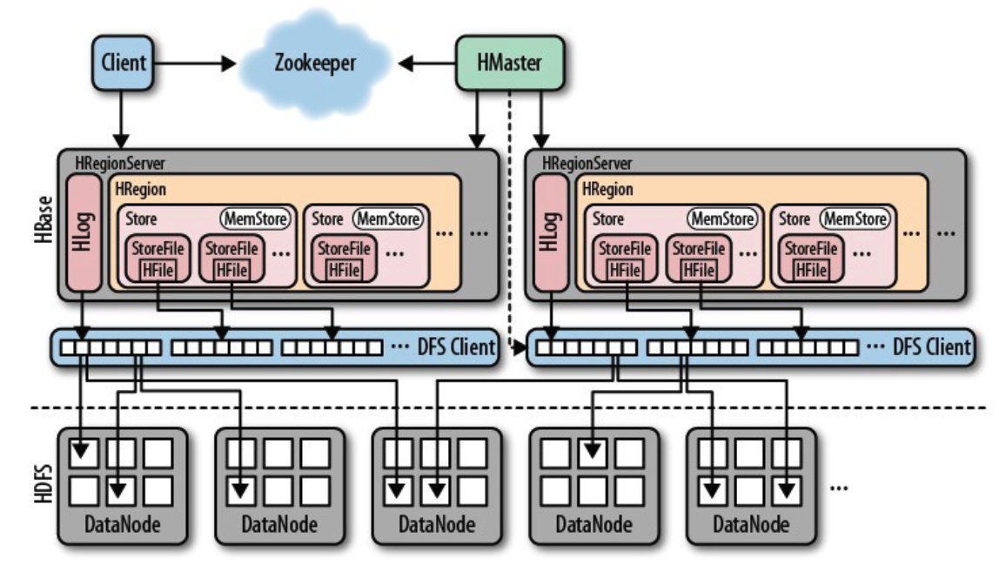
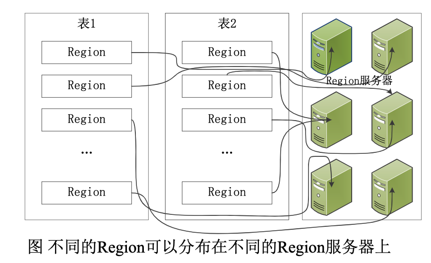
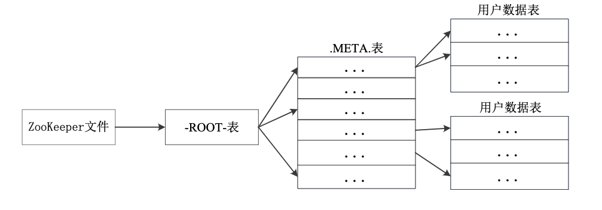
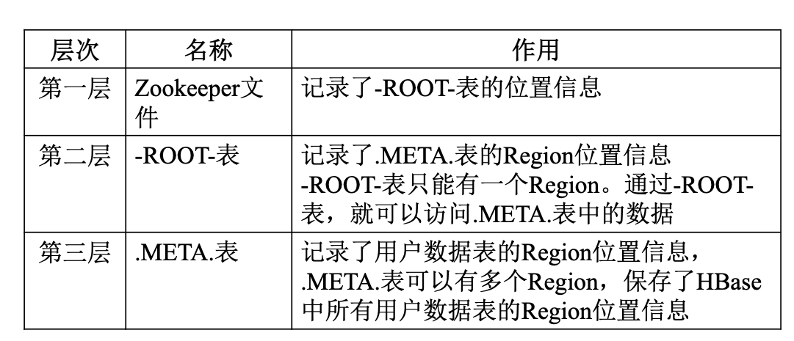

# HackBase

> zju大规模系统构建课程作业。

---

## 6.6 更新

### Client查询中系统整体流程
#### 读写操作等
1. 通过`zookeeper`查找对应的`Region Server`的地址
2. 向`Region Server`发送读写等请求

#### 新建表的操作
1. 向`Master`发送建立表的请求
2. `Master`建立region（目前版本一个region对应一个一个table）并分配该`region`给某个`Region Server`
3. 返回该`Region Server`的地址给`Client`

### Master需要负责的功能
1. 管理和维护表的分区信息（哪个region在那一台server上）（参见HBase架构里面的META表）
2. 副本维护：预留接口（暂时先不做该功能）
3. 负载均衡：监测到某个`Region Server`负载过高的时候，将访问最频繁？最不频繁（需要注意热点过热的问题）的`Region`转移到其他的`Region Server`上（`Region Server`需要不断向`zookeeper`汇报自己的状态信息
4. 容错容灾：监测`zookeeper`中的`Region Server`信息，如果某台`Region Server`掉线了，则将该其中的`Region`移动到其他的`Region Server`上（？存在疑问：如何在server挂了之后访问到其的`Log`文件并发送给其他`Region Server`）

### Region Server需要负责的功能
1. 对minisql的操纵（这部分简单，修改接口即可）
2. Log文件的记录（日志格式，如何存储等）
3. 根据Log文件重启回复（容错容灾步骤）
4. 查看自己的性能指标并向？汇报
5. 与`Client`通讯的接口
6. 和`zookeeper`通讯（第一次启动的注册）

---
## 6.4 更新

> RIP 就連香港都禁止悼念了

人员分工：
1. lc, lxw: master, zookeeper
2. hsy, zy: client, region server, HackDFS(这部分打算照搬minisql)

==从今天之后，更新都在对应的文件夹中分开进行。==

==同时更新了参考文件：lwm关于分布式minisql的pdf，具体请移步至refs==

## 6.1更新

### todo

- [x] [Thrift]([Thrift: The Missing Guide (diwakergupta.github.io)](https://diwakergupta.github.io/thrift-missing-guide/#_versioning_compatibility)

目前需要考虑的问题：

- [x] ~~底层文件系统按照传统方式（行储存）还是按照`HDFS`的列式储存~~`按照行存`
- [x] ~~`Region Server`这部分使用`C++`还是`java`~~使用`c++`

---

## 架构

### 组件

1. Client
2. Master: 管理维护表的分区信息、维护`Region Server`列表、分配`Region`和负载均衡
3. Region Server：存储和维护分配给自己的`Region`、处理来自`Client`的读写请求
4. Related to Zookeeper：实现`Region`的定位和心跳检测等
5. HackDFS（the file system)

### Region 和 Region Server

### Region的定位

---

## 参考：

1. lwm课件（见`refs`中）
